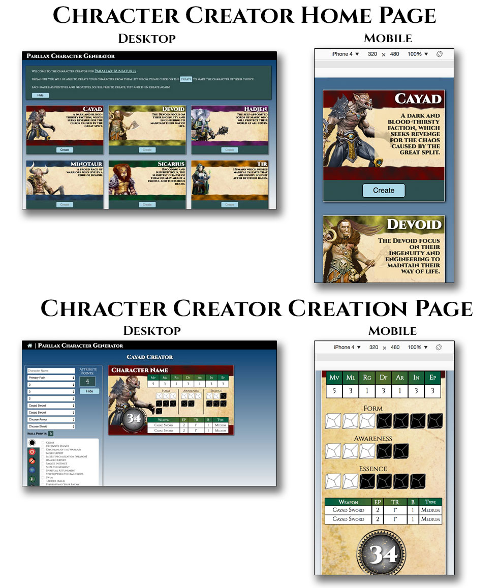

# Parallax: Warbands - Character Creator

Parallax: Warbands is a table-top miniatures game, which combines elements of a Role Playing Game (RPG) with a table-top miniatures game.  Players are encouraged to make their own characters in which to play with.   

Currently, the only way to do this is with an Excel file, which is difficult to use and kind of boring.  

The goal of this capstone was to take the look and feel of the game and allow players to create their own characters.  Although currently, this project is limited to the Cayad (Wolfman) race – it is really a proof of concept, which will be fully rounded out in the Node.js project.  This project does take into account that users will be looking at it on a desktop as well as mobile device.  

As there wasn’t a pre-built API, custom JSON files were created and calls were made to populate the cards.  The home screen shows the different races and are populated through a template file, which makes it easier to make consistent change as well as add new races in the future.  

More than 40 custom JSON files were created for this project, covering races, abilities, skills and weapons.   

A sample data call is:  
`http.get("data/skills/generalSkills.json",function(data)
{
		generalSkills=data;
		…
	)};`

<strong>Technology Used:</strong> 
HTML 
CSS  
JavaScript  
JQuery 
JSON 

Additional Resources include: 
<ul>
<li>Tooltipster (http://iamceege.github.io/tooltipster/) </li>
<li>TinyPNG (https://tinypng.com/) - Used to make images smaller, reducing bandwidth</li>
<li>Font-Awesome (http://fontawesome.io/)– For the cool looking “Home” image</li>
<li>StackOverflow – Used to look for similar programming difficulties to overcome challenges</li>
</ul>

I would also like to thank: 
<ul>
<li>Neville Bonavia – An amazing programmer and mentor who answered numerous questions and challenged me to make this project all it could be!</li>
<li>Rick Hershey - All the beautiful original artwork was created by Rick Hershey for Parallax.</li>
</ul>

# Parallax_Capstone_2_Node
# Parallax_Capstone_2_Node
